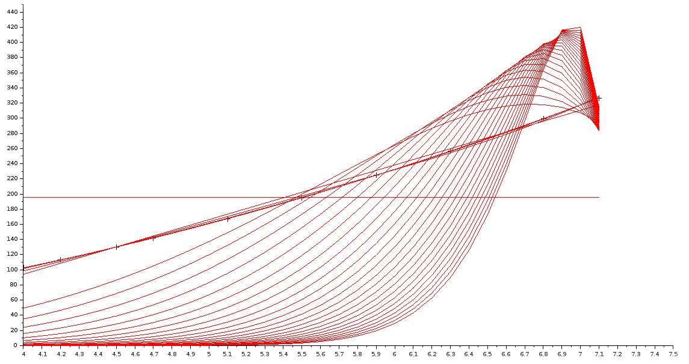

# Métodos Numéricos

## Dudas

- En Scilab, lo siguiente da error:

  ```javascript
  p = poly([1, 3, 2], "x", "c")
  r = roots(p)
  horner(p, r(1)) < %eps
  ```

  Por qué?

  Respuesta: al parecer, horner devuelve un número complejo, se soluciona con:

  ```javascript
  - real(horner(p, r(1))) < %eps
  ```

- En Scilab, esto también da error:

  ```javascript
  A = [0 2 4; 1 -1 -1; 1 -1 2];
  spec(A) > 1e-15;
  ```

  Respuesta: por la misma razón que en el anterior, hay que usar la función "real" a lo que devuelve "spec".

- Cómo obtengo la n-ésima derivada sin que el error sea catastrófico?

  Respuesta: googleá derivada numérica.

## Bitácora

El checkbox indica si asistí o no a la clase.

Semana 1

- [x] Dia 16/08: Teoría, vimos la primer parte del apunte de sucesiones y series numéricas.

- [x] Dia 17/08: Teoría, vimos la segunda parte del apunte de sucesiones y series numéricas.

- [ ] Dia 18/08: Práctica, dieron una introducción a Scilab.

Semana 2

- [x] Dia 23/08: Teoría, vimos lo que quedaba del apunte de sucesiones y series numéricas. No se vió, ni se va a ver el tema de sucesiones y series de funciones. También se vio la representación de números en forma binaria, y según las normas IEEE754.

- [ ] Dia 24/08: Práctica, scilab.

- [x] Día 25/08: Terminamos la teoría de errores, y practicamos series.

Semana 3

- [x] Día 30/08: Terminamos el tema de errores, empezamos por un repaso de polinomios de Taylor, de como medir su error, y vimos el primer root finding method, que es el método de la bisección.

- [ ] Día 31/08: Práctica de series.

- [ ] Dia 01/09: Dieron método de la secante y de
  newton, y al parecer un toque de práctica de
  errores.

Semana 4

- [ ] Día 06/09: Método de la falsa posición, punto fijo.

- [ ] Día 07/09: Asumo que dieron práctica.

- [x] Día 08/09: Empezamos la unidad 4, de sistemas de ecuaciones no lineales.

Semana 5

- [x] Día 13/09: Vimos como resolver exactamente sistemas de ecuaciones, método
  de Gauss, de Gauss Jordan, eso.

- [x] Día 14/09: Hicimos práctica 2 todo el día.

- [x] Día 15/09: Dimos banda de teoría de matrices definidas positivas, y eso.

Semana 6

- [x] Día 20/09: Dimos factorizacion QR, el problema de los minimos cuadrados,
  y normas matriciales y vectoriales.

- [x] Dia 21/09: Dia de la primavera, no hubo clases.

- [x] Dia 22/09: Mas sobre normas y estabilidad numerica de sistemas lineales.

Semana 7

- [x] Dia 27/09: Teoría, dimos el método de Jacobi, Gauss-Seidel, Esquema general de métodos iterativos, teorema (condición de convergencia), teorema de estabilidad asintótica y corolario. Salimos
  antes por amenaza de bomba.

- [x] Dia 28/09: Clase práctica, hicimos todos los ejercicios de la práctica 4 menos el de la factorización de Cholesky, Nico dió una explicación de eso en el pizarrón, aunque aún no queda claro como programarlo.

- [x] Dia 29/09: Matriz diagonalmente dominante (devuelta), método de Jacobi,  teorema de convergencia.

Semana 8

- [x] Día 04/10: Repaso antes del exámen.

- [ ] Día 05/10: EXÁMEN TEÓRICO, no fuí porque no puedo rendirlo, no tengo aprobada Álgebra Lineal. Preguntaron:

    - Dar las expresiones de sumas parciales de las series telescópica y geométrica. Explicar bajo qué condiciones convergen y divergen.
    - Explicar la diferencia entre error relativo y absoluto. Justificar cuál es más correcto para revisar la precisión de una aproximación. Explicar supresión de cifras significativas y dar un ejemplo.
    - Explicar Método de Newton. Dar su orden de convergencia y demostrarlo. Decir bajo qué condiciones tiene una única raíz en un intervalo [a,b]. Demostrarlo.
    - Explicar en qué consiste factorización QR y cómo se la consigue.

- [x] Día 06/10: EXÁMEN PRÁCTICO.

Semana 9

- [ ] Día 11/10: Pedir lo que se dió, falté.

- [X] Día 12/10: Clase práctica, hice la primer parte del ejercicio 1 de la práctica 5, me codeé mi propio Jacobi y Gauss Seidel.

- [ ] Día 13/10: Pedir lo que se dió, no fui por la TecnoMate.

Semana 10

- [x] Día 18/10: Empezamos con interpolaciones, vimos la existencia y unicidad del polinomio interpolante, la matriz de Vandermonde, la interpolación de Lagrange, diferencias divididas, e interpolación por diferencias divididas de Newton.

- [x] Día 19/10: Última clase para hacer la práctica 5.

- [x] Día 20/10: Dimos el error de la interpolación polinomial, y lo demostramos con el teorema generalizado de Rolle.

Semana 11

- [ ] Día 25/10: Falté, pedir lo que dieron.

- [x] Día 26/10: No hubo clases, JCC 2017.

- [x] Día 27/10: No hubo clases, JCC 2017.

Semana 12:

- [x] Día 01/11: La clase la dio Nico, dimos teorema de Weierstrass, aproximación de mínimos cuadrados.

- [x] Día 02/11: Clase práctica, empezamos la práctica 7.

- [x] Día 03/11: Dimos métodos de integración numérica, y continuamos la práctica 7.

Semana 13:

- [x] Día 08/11: Faltan completar cosas, pero vimos el método compuesto de Simpson, su error, e integración numérica con dominio bidimensional. También anotamos demostraciones que no son necesarias saber para el parcial teórico.

- [x] Día 09/11: Clase práctica.

- [x] Día 10/11: Clase práctica.

Semana 14:

- [x] Día 15/11: Clase de repaso para el parcial.

- [x] Día 16/11: Clase práctica.

- [x] Día 17/11: Clase práctica.

Semana 15:

- [x] Día 22/11: Repaso antes de los parciales.

- [ ] Día 23/11: Segundo parcial, teoría.

- [x] Día 24/11: Segundo parcial, teórico.

## Arte


